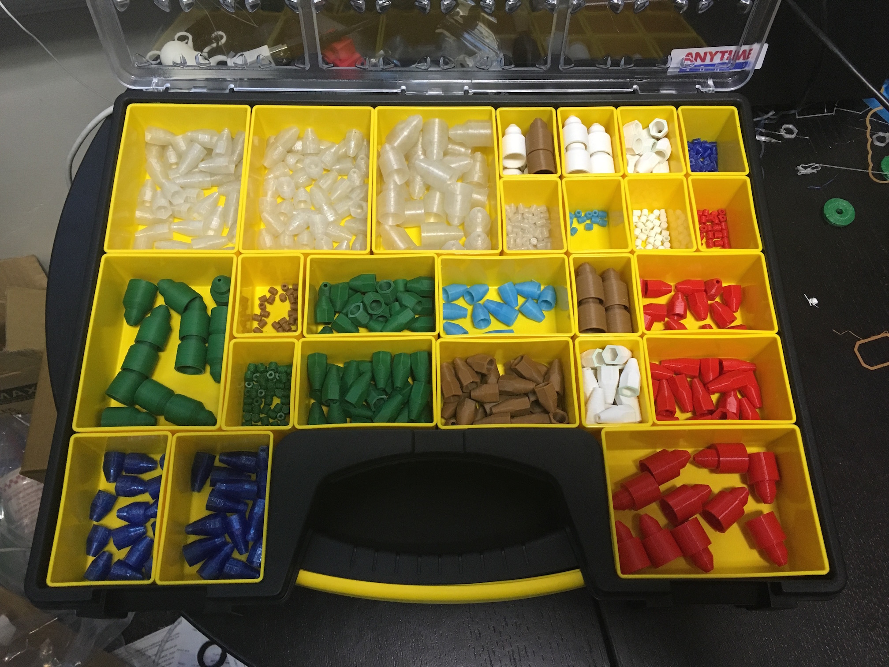

One challenge with a project like these antennas is that we are constantly looking for ways to improve on our previous designs. The reason this is a challenge is that often when we develop an improvement which has significant advantages it also changes the appearance of the antenna, which both creates the possibility that people will not like the change and creates a transitory period where people expect the product to remain constant but we have some stock of the old and some of the new.

That said, we've been experimenting with a 3d printer and have started producing covers for the antenna and anti-eye-pokers (that's a highly technical term) for the tips. Here are some pictures of what the new antennas look like:


  
  
  
  
  
  
  
  
  


## Advantages

There are several key reasons that we have decided to adopt this approach:

- Ham Radio antennas + 3d Printers.  Duh.
- The glue caps (connector covers) are custom designed to both improve your grip on the antenna connector and to hold the epoxy in exactly the place where it is needed, thus these are more structurally sound than the previous version.
- With these connectors we don't need the rubber coating and the epoxy is much easier (and more reliable) to apply.
- The new tips require just a little easily applied glue and are consistent.
- There are literally dozens if not hundreds of colors and textures of material we could make the connectors with.
- In summary, the new method:
    - Is awesome
    - Is faster to build
    - Is more reliable
    - Is more consistent
    - Allows more customization

## Current colors

We've just about got the process to where we can "mass produce" (about 30 at a time) the caps and tips, so we've started stocking up.  What we haven't decided is which colors to use.  Here is what we have right now:

The colors are:

- Black
    - Note that we don't like black tips, so these will have other colors for the tips.
    - The reason we don't like black tips is that they are hard to see, so we keep poking our eyes out and we're running short on spare eyes.
- Super-bright glow in the dark
- White
- Brown / wood colored
- Translucent royal blue
- Green
- Light blue / glow in the dark (not super bright)
- Red
- Pink (none printed currently, but we have it)

We have ordered some more filaments and hope to add to this:

- Solid blue
- Yellow
- Purple

As you can see, there are a lot of options; we will probably make a bit of everything and see what people like, but it's hard to have any guarantee that anything will be in stock with so many options.

## Which colors should we keep?

Leave a comment please and let us know what colors you think should be "standard"?  Would you pay extra (probably $5 or $10) to have a custom antenna made with a specific color?  What do you think of the change?
