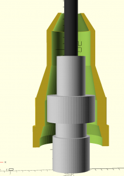
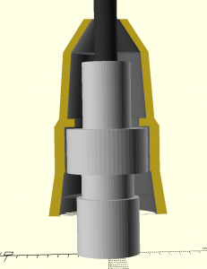
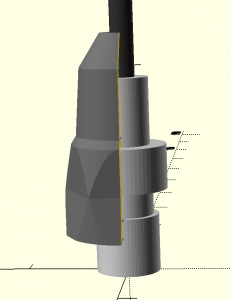
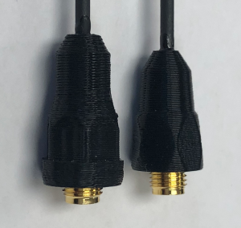
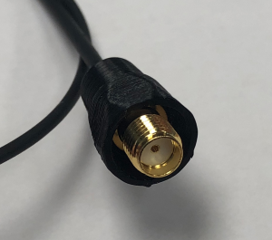
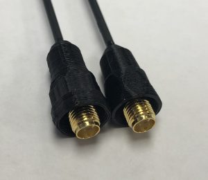
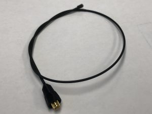
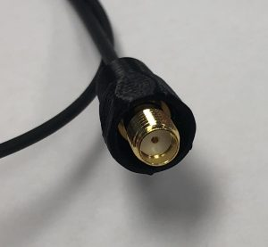
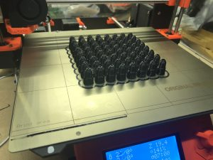

It's interesting how sometimes small side effects can add up over time to be a real problem.  Recently I've had a couple of concerning support requests which led me to start taking some measurements, and I discovered something concerning: our SMA-F connector covers have been gradually changing over time, slowly enough that I had not noticed until it started being an issue for a few customers.

Keep in mind, this is not a problem which affects most customers -- users of most Baofeng radios would not likely see an issue -- but it revealed a flaw in our design and process which was just a little concerning.

## The old glue cap

We refer to those plastic covers as "glue caps" -- though it's true that they make our antennas look a lot nicer, the design is actually intended to hold the adhesive (glue) where it will do the most good.  I've gotten a lot better over time at designing 3d models, but it's been awhile since I really looked at our glue caps.  One thing that did not previous occur to me (when I first was learning to design 3d-printable models and made the glue caps we use today) was that with the modeling tool I use (openscad) it's very possible to design while using a cross section view, allowing me to see a dimensionally accurate approximation of the connector inside the gluecap as I work.

Looking at the old cap, it's easy to see where the problem came from:

As you can see, it's the tapered portion that is intended to prevent the connector from going too deeply into the glue cap. Changes over time have primarily focussed on better holding the glue in the glue cavity at the top... unfortunately, that's resulted in less resistance to putting the connector in too far and less protection against the connector getting crooked.

It's important to note that the antennas should still work, but they did result in some cases with insufficient threads coming out the bottom.  Note that if you have an antenna where this is an actual problem, please [RMA the antenna](https://signalstuff.com/rma/) and we'll get you the new module. 99% of you will not have an issue even with the "flawed" version of the caps.

## The new glue cap

I redesigned the new glue cap from scratch: I remeasured the connectors with high resolution calipers, built it from the ground up using a cross section mockup, and integrated a "connector stop" which should prevent the connector from going in too far as well as do a much better job of keeping the connector straight.

It's interesting to note that I discovered that the connector caps can actually be smaller while still actually being stronger; this is because the primary strength of the connector comes from the high quality adhesive we use during the manufacturing process which the new cap does a much better job of holding in the critical places.

## Side by side comparisons

For those interested, here is a side by side comparison of the finished result:

## More photos




