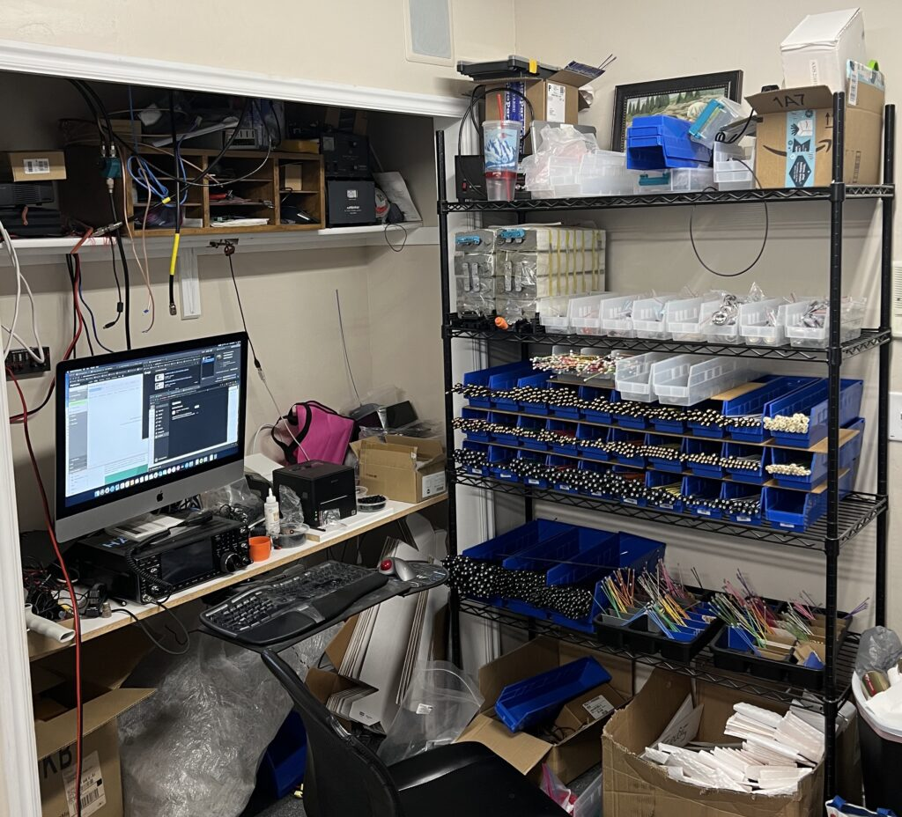

Another year passed and we're in November already! Several of you have asked already if we are doing a Black Friday sale -- as a policy we don't give out details of any sales before we announce them. This is a good company policy because aside from other considerations it nicely obscures the fact that I usually decide exactly what we're doing while we are typing up the announcement. Shhh... don't tell!

This has been a crazy year and the most notable change is that I've had to outsource most antenna manufacturing to a local company here in Utah County instead of building them all myself; I hated to do that for a number of reasons, but I just don't have time to keep up with building antennas and still write software, and since SignalStuff exists primarily to enable [HamStudy](https://ham.study) and [ExamTools](https://exam.tools) that would kinda defeat the purpose!

### Here are some interesting things that have happened this year:

- Most Signal Sticks were built by a local company instead of by myself (Richard, KD7BBC) and local volunteers
- We have switched to black connectors on most Signal Sticks and all adapters
- We have introduced a new [Half-Wave super-elastic signal stalk](https://signalstuff.com/product/super-elastic-signal-stalk-half-wave/)
- HamStudy now has Spanish translations of the question pools (but the software hasn't been updated to fully use them yet, sadly. You can still study them if you [know](https://hamstudy.org/tech2018es) [the](https://hamstudy.org/general2019es) [URL](https://hamstudy.org/extra2020es))
- ExamTools, our license exam administration software, was involved in over 30% of the exams administered in the last 12 months! Those exams were easier to administer, more random (no reuse), and generally resulted in people getting their callsigns much more quickly! About 80% of those were remote and the other 20% were in-person.
- SignalStuff hired someone to manage shipping -- but sadly life changes on the part of the employee have resulted in shipping returning to my basement.

The SignalStuff Super-Soporific Shipping Station

### Here are some things that are still coming up:

- Sometime soon we plan to have a rubber cover on the outside of the BNC connectors which will hide the notches and just generally look nice.
- We are working to get Signal Stalk wires which will handle lower temperatures
- More ExamTools features are being added all the time, with a new registration process and better team management features being high on the list
- I am experimenting with using Machine Learning and Artificial Intelligence to provide more effective ways to analyze the question pools and study effectively -- nothing specific to promise yet, but there are a lot of possibilities.

This is all quite a bit for a single person to do -- even with all the help various people give me -- so I appreciate the support of all of my customers!

## The sale

Okay, this is what you've really been waiting for. Thanks for letting me ramble! Sadly I can't discount quite as much as I have in some past years -- material prices are increasing and I'm no longer building things myself. In fact, we will almost certainly be increasing prices in early 2022, so this may be the cheapest you'll find our products from this time forward! That said, I hope you'll still find it helpful =\]

Our sale will start on Friday, Nov 26, 2021 and last through Monday, Nov 29, 2021, with the following discounts:

- [Half-wave Signal Stalk](https://signalstuff.com/product/super-elastic-signal-stalk-half-wave/) - $55 **$50**
- [Classic Quarter-wave Signal Stalk](https://signalstuff.com/product/super-elastic-signal-stalk/) - $32 **$30**
- Adapters:
    - [SMA-Female to BNC](https://signalstuff.com/product/sma-f-to-bnc-f-adapter/) - $4.00 **$3.50**
        - **Note:** These are out of stock, but we are expecting a shipment in the next 14 days
    - [SMA-Male to BNC](https://signalstuff.com/product/smam-to-bnc-adapter/) - $4.50 **$4.00**
    - [SMA-Female to SMA-Female](https://signalstuff.com/product/sma-f-to-sma-f-barrel/) - $4.00 **$3.50**
    - [SMA-Male to SMA-Male](https://signalstuff.com/product/sma-m-to-sma-m-barrel/) - $4.00 **$3.50**
- [Super-Elastic Signal Sticks](https://signalstuff.com/product-category/antennas/signal-sticks/)
    - All Black - $20 **$18**
    - All Glow in the Dark - $26.50 **$23.00**
    - All other colors: $23 **$20**
- All-new [BNC Magnetic Mount for Signal Sticks](https://signalstuff.com/product/bnc-magnetic-mount-for-signal-sticks/)
    - When we say "all new" we mean "we finally got it in stock and added it to the site halfway through the sale" -- it's that new =\]
    - Introductory price: **$20.00 **$15.00****

**PLEASE NOTE:** Orders placed before the sale starts or after it ends will not get the discounts; if you didn't read the dates, we're very sorry but are still happy to sell you items at regular price.

73!
