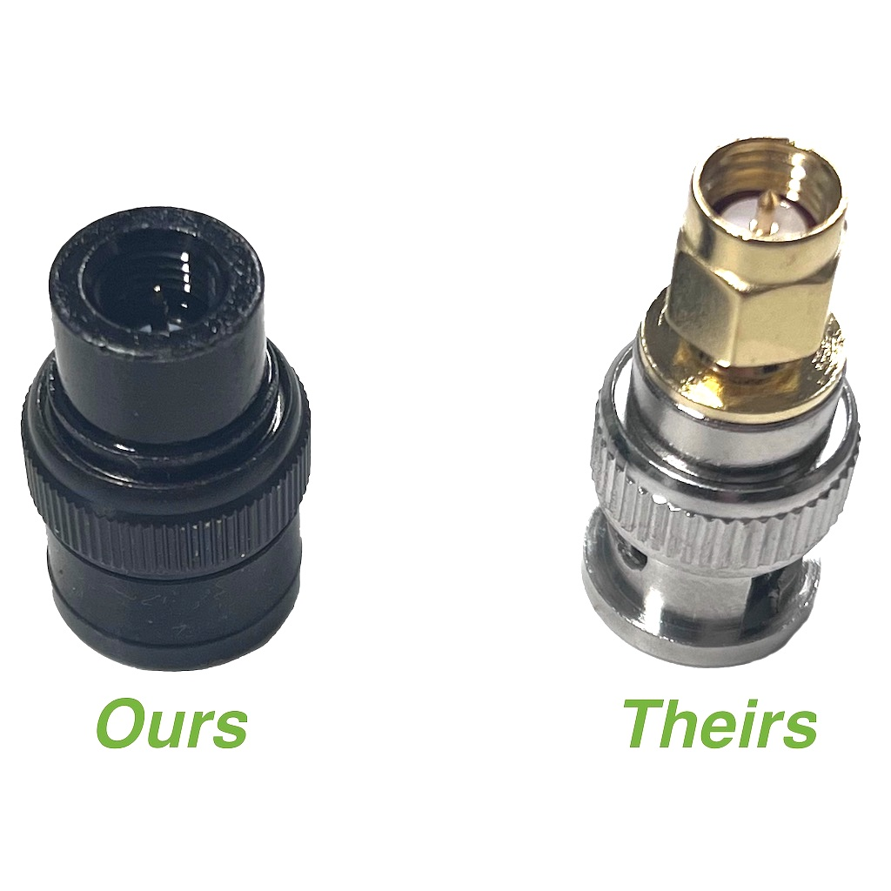

**NOTE: The sale is over, thanks to all who supported us through this event!**

Another year mostly on the books! The support from our customers has been overwhelming and I sincerely appreciate it! It is truly staggering to realize just how big this has become! Here are some interesting stats:

Product sales (on the website only) between Jan 1, 2023 and Oct 30, 2023:

- 14,807 Signal Sticks
    - 7,683 [BNC](https://signalstuff.com/product/super-elastic-signal-stick-bnc/)
    
    - 4,055 [SMA-F](https://signalstuff.com/product/super-elastic-signal-stick-sma-female/)
    
    - 3,069 [SMA-M](https://signalstuff.com/product/super-elastic-signal-stick-sma-male/)

- 9,967 Adapters
    - 4,145 [SMA-F to BNC-F](https://signalstuff.com/product/sma-f-to-bnc-f-adapter/)
    
    - 3,257 [SMA-M to BNC-F](https://signalstuff.com/product/smam-to-bnc-adapter/)
    
    - 1,030 [BNC-M to SMA-M](https://signalstuff.com/product/bnc-m-to-sma-m-adapter/)
    
    - 754 [BNC-M to SMA-F](https://signalstuff.com/product/bnc-m-to-sma-f-adapter/)
    
    - 479 [SMA-F to SMA-F](https://signalstuff.com/product/sma-f-to-sma-f-barrel/)
    
    - 302 [SMA-M to SMA-M](https://signalstuff.com/product/sma-m-to-sma-m-barrel/)

- 5,294 [rubber spacers](https://signalstuff.com/product/rubber-washer-spacer/)

- 1,314 [BNC Magmounts](https://signalstuff.com/product/bnc-magnetic-mount-for-signal-sticks/)

- 392 [1/4 wave Signal Stalks](https://signalstuff.com/product/super-elastic-signal-stalk/)

- 227 [Signal Staffs](https://signalstuff.com/product/signal-staff-osj/)

Not bad for a business created to support a study website! Thank you so much for all of your support!

## New in 2023

First, the bad: This year we have temporarily discontinued the half wave signal stalk, pending some additional testing to explain some issues that we have been unable to reproduce. I have hopes to bring them back next year but I need to make sure we're able to support them.

Next, the good! We have introduced two new exclusive adapter types -- the [BNC-M to SMA-M](https://signalstuff.com/product/bnc-m-to-sma-m-adapter/) and the [BNC-M to SMA-F](https://signalstuff.com/product/bnc-m-to-sma-f-adapter/). These adapters are perfect to put on your BNC Magmount if you need to use the stock antenna from your radio -- or just another antenna that isn't available in BNC. While you can of course get adapters to make that change elsewhere, I think you'll agree that ours are quite a bit more streamlined and nicer than is typical -- in fact I had these custom made for us and I haven't seen the like elsewhere.

Additionally we're still making incremental improvements to the BNC magmount -- I have maybe 200 left of our current stock and then the next batch will have a thicker rubber cover which should be significantly less likely to tear. We'll also make that cover available by itself when we have it. I can't start including them until we have them, though, so most of the ones sold during this sale I'm afraid will still have the old ones. Granted, those are still pretty good, we just want to make them better =\]

Finally, I'd like to officially welcome Jessica and David to my team this year -- Jessica is handling order fulfillment and first line support and David has taken over nearly all manufacturing so that I can spend more time working on [HamStudy](https://ham.study) and [ExamTools](https://exam.tools). Thanks folks!

## The 2023 sale

Without further yapping or wasting of time, here is the sale!

### When:

The 2023 sale will begin Friday, Nov 24 and run through Tuesday Nov 28. That's one day longer than usual, just because I felt like it while writing this post ;-)

### What:

This may look familiar -- it'll look pretty much the same as last year. I could change it, but that would require more work than I'm currently willing to put into it =\]

I'm trying something new this year and announcing the sale ahead of time -- remember this won't be active until Friday Nov 24, 2023! Also, I expect we'll end up with some backorders -- we should be able to get any of those shipped within two weeks at the most.

- [Classic Quarter-wave Signal Stalk](https://signalstuff.com/product/super-elastic-signal-stalk/) - $35 **$32**

- Adapters:
    
    - [SMA-Female to BNC](https://signalstuff.com/product/sma-f-to-bnc-f-adapter/) - $5.00 **$4.00**
    
    - [SMA-Male to BNC](https://signalstuff.com/product/smam-to-bnc-adapter/) - $5.00 **$4.00**
    
    - [SMA-Female to SMA-Female](https://signalstuff.com/product/sma-f-to-sma-f-barrel/) - $5.00 **$4.00**
    
    - [SMA-Male to SMA-Male](https://signalstuff.com/product/sma-m-to-sma-m-barrel/) - $5.00 **$4.00**
    
    - [BNC-Male to SMA-Female](https://signalstuff.com/product/bnc-m-to-sma-f-adapter/) - $5.00 **$4.00**
    
    - [BNC-Male to SMA-Male](https://signalstuff.com/product/bnc-m-to-sma-m-adapter/) - $5.00 **$4.00**

- [Super-Elastic Signal Sticks](https://signalstuff.com/product-category/antennas/signal-sticks/)
    - All Black - $22 **$20**
    
    - All Glow in the Dark - $29.00 **$26.50**
    
    - All other colors - $25 **$22**

- [BNC Magnetic Mount for Signal Sticks](https://signalstuff.com/product/bnc-magnetic-mount-for-signal-sticks/) - $21 **$19**
    - (Last year I promised I'd try to discount them, so there you go)
