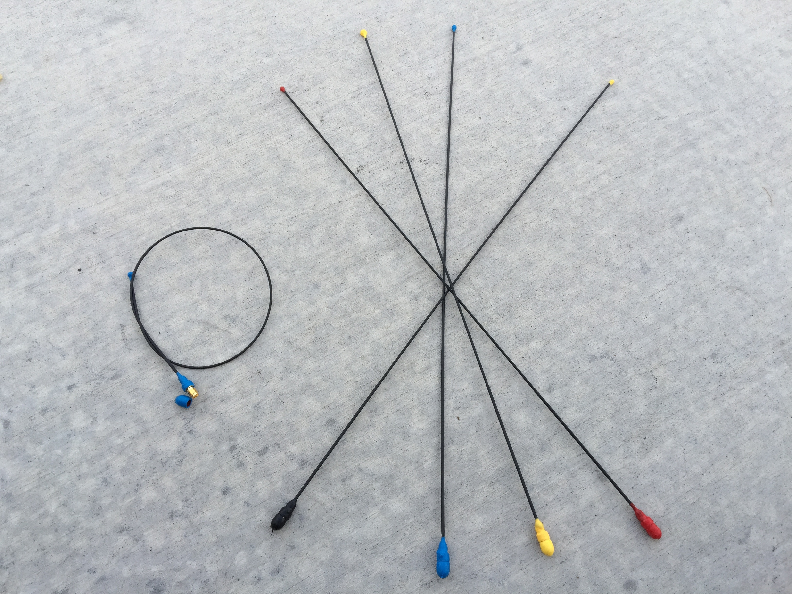

Many recently have asked for reviews of the SuperElastic Signal Stick antenna. I can't provide an unbiased review, since I'm the one who keeps the project going and organizes build-it nights to keep them stocked, but I thought I'd share with you some of the details of the construction.

If anyone wants to post a youtube review please let me know and I'll link to it from this page.  If you have trouble with yours, please contact me before doing the review and give me a chance to correct it -- not because I want to hide any actual flaws, but because we do have a lifetime warranty and I want to make sure you're reviewing the working product.  I've had much fewer than 1% of the antennas sold ever returned for any reason (defect or breakage, both of which are covered), but accidents do happen when building this by hand.

## The origin of the Super-Elastic Signal Stick

Approximately 15 years ago I made my first antenna following this general design.  These are based on the traditional "1/4 wave piano wire antenna" design; it turns out that 1/4 wave on 2m is roughly 3/4 wave on 70cm, and a 3/4 wave antenna performs roughly the same as a 1/4 wave antenna, which makes these work equally well on both 70cm and 2m.

These antennas were originally made with stainless steel wire as a fundraiser for a ham radio youth group (the one I [met my wife in](invite_ham.jpg), actually). Over the years we've improved the design dramatically, most notably by changing to use [nitinol superelastic wire](https://www.fwmetals.com/materials/nitinol/superelastic-nitinol). When the youth group shut down I was assistant advisor to it and due to continued demand I took over the project and have continued selling them as a fundraiser for first [HamStudy.org](https://hamstudy.org) and later also for [ExamTools](https://exam.tools).

All that said, there is a reason that people still want these. We have always done a lifetime guarantee, and that is no joke -- if it breaks, mail it back to me and I'll send you a replacement. I have literally shut this in my truck door numerous times (both on purpose and accidentally) and other than scuffing the heat shrink it doesn't phase it at all. Back when we did them with stainless steel piano wire someone had one bit in half by a horse (we warranty that too) but we haven't had a repeat attempt so don't know if the titanium version would have survived.

The two most common failures that I have are when the wire breaks off right at the connector and occasionally the wire (with enough force) pulls out of the connector. Other than that, I've never had one break, and out of about 800 of these that I've made in the last year (with help from other local hams, thank goodness) I've had about 5 returned for replacement due to failure or breakage. After a recent batch ended up with a flawed batch of epoxy that I almost missed, my standard QA test before shipping them is to pull as hard as I can in opposite directions on the wire and connector. If it doesn't come apart, it passes and I ship it =\]

I don't have the equipment to objectively compare these with other antennas, but anecdotally I have never had anyone tell me that their antenna performed less well than other comparable commercial antennas; I have had many people tell me that they worked better.  Whether that's because people are polite or because they really work better than other antennas is something that someone else will have to decide.

## SWR readings

One important difference between most handheld antennas and base station antennas is that handheld antennas are far less stable (from an SWR perspective) than a base station antenna.  Do not expect to connect this to an SWR meter or antenna analyzer and get a 1:1 reading; you actually might get that reading, but it will depend on where you are standing, how close to the radio you are standing, how far from your body it is, what is nearby, what other RF fields there are, ....

The reason for this is that you are using half of a dipole; that's really what a 1/4 wave antenna (and the vast majority of handheld antennas) is.  The other half of the dipole is.... your arm, the radio, etc.  This means that the actual SWR is going to tend to be all over the place, and that ends up being just fine.  The nice thing about a 1/4 wave antenna is that unlike a "rubber duck" or other compromise antenna they have a relatively wide frequency coverage, and so they actually work very well despite all of this variance.

The exceptions to this rule are antennas which use a matching section to put both halves of a dipole into the antenna, which is something we don't have the manufacturing capability to do.  In addition, Super-Elastic Signal Sticks are designed to be a simple, durable, all-purpose go-to antenna which can be easily coiled up for storage.  Making them more high-tech and complicated would probably do more damage in making them more breakable than it would help.

If you have any questions, please feel free to ask them in the comments and I'll answer as best I can.
